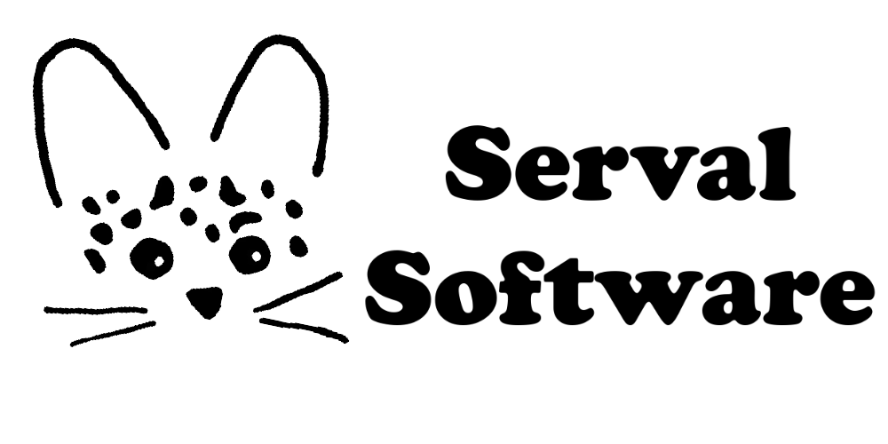

# Serval Games

Bienvenue étranger!! Te voici dans l'antre de Serval Software.

Serval Software est parti en mer aidé les marins qui se sont perdus.
Pas de panique! Je sais que tu es un pro. Résouds les mini défi pour pouvoir aider l'équipe dans leur quête.

# Défi nuit de l'info 2021: 
## A la conquête de "l’œuf de pâques" 
il y a 10% de chance d'etre redirigé lorsque l'on navigue sur notre site (menu), et lorsque l'on clique sur le logo "Serval Software" de la page home, on se fait aussi rediriger.

# L'équipe

* **Fanny Lourioux** - [Github](https://github.com/FannyLourioux) - [LinkedIn](https://www.linkedin.com/in/fanny-lourioux-4744941a0/)
* **Trystan Roches** - [Github](https://github.com/Trystan4) - [LinkedIn](https://www.linkedin.com/in/trystan-roches-4a6ba0171/)
* **Romain Vacheret** - [Github](https://github.com/RomainVacheret) - [LinkedIn](https://www.linkedin.com/in/romain-vacheret-b58270189/)
* **Chakir Ardenne** - [Github](https://github.com/chakirardenne) - [LinkedIn](https://www.linkedin.com/in/chakir-ardenne-6000621a1/)

